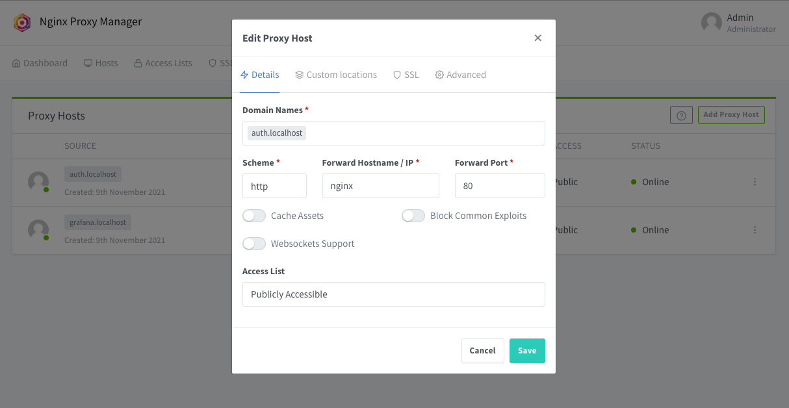
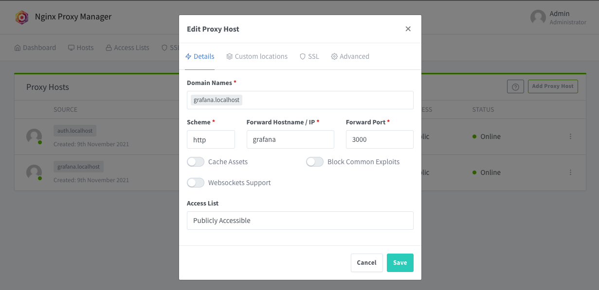
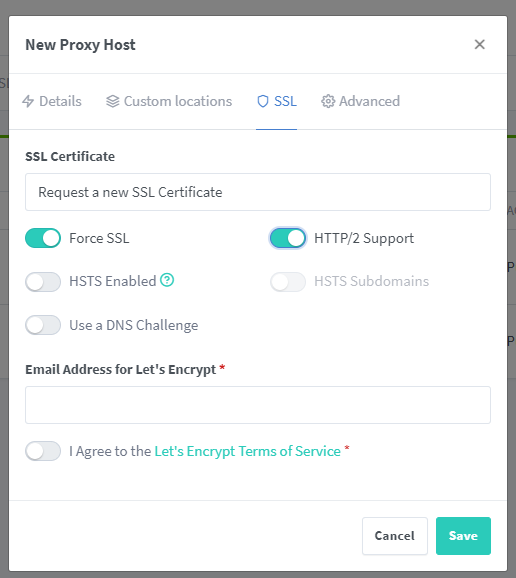

# Alliance Auth -- Docker

## Prerequesites
You should have the following available on the system you are using to set this up:
* Docker - https://docs.docker.com/get-docker/
* git
* curl

## Setup Guide

1. run `bash <(curl -s https://gitlab.com/allianceauth/allianceauth/-/raw/v2.14.x/docker/scripts/download.sh)`. This will download all the files you need to install auth and place them in a directory named `aa-docker`. Feel free to rename/move this folder.
1. run `./scripts/prepare-env.sh` to set up your environment
1. (optional) Change `PROTOCOL` to `http://` if not using SSL in `.env`
1. run `docker-compose --env-file=.env up -d` (NOTE: if this command hangs, follow the instructions [here](https://www.digitalocean.com/community/tutorials/how-to-setup-additional-entropy-for-cloud-servers-using-haveged))
1. run `docker-compose exec allianceauth bash` to open up a terminal inside your auth container
1. run `auth migrate`
1. run `auth collectstatic`
1. run `auth createsuperuser`
1. visit http://yourdomain:81 to set up nginx proxy manager (NOTE: if this doesn't work, the machine likely has a firewall. You'll want to open up ports 80,443, and 81. [Instructions for ufw](https://www.digitalocean.com/community/tutorials/ufw-essentials-common-firewall-rules-and-commands))
1. login with user `admin@example.com` and password `changeme`, then update your password as requested
1. click on "Proxy Hosts"
1. click "Add Proxy Host", with the following settings for auth. The example uses `auth.localhost` for the domain, but you'll want to use whatever address you have auth configured on
  
1. click "Add Proxy Host", with the following settings for grafana. The example uses `grafana.localhost` for the domain
  

Congrats! You should now see auth running at http://auth.yourdomain and grafana at http://grafana.yourdomain!

## SSL Guide
Unless you're running auth locally in docker for testing, you should be using SSL.
Thankfully, setting up SSL in nginx Proxy Manager takes about three clicks.
1. Edit your existing proxy host, and go to the SSL tab. Select "Request a new SSL Certificate" from the drop down.
1. Now, enable "Force SSL" and "HTTP/2 Support". (NOTE: Do not enable HSTS unless you know what you're doing. This will force your domains to only work with SSL enabled, and is cached extremely hard in browsers. )
  
1. (optional) select "Use a DNS Challenge". This is not a required option, but it is recommended if you use a supported DNS provider. You'll then be asked for an API key for the provider you choose. If you use Cloudflare, you'll probably have issues getting SSL certs unless you use a DNS Challenge.
1. The email address here will be used to notify you if there are issues renewing your certificates.
1. Repeat for any other services, like grafana.

That's it! You should now be able to access your auth install at https://auth.yourdomain

## Adding extra packages
There are a handful of ways to add packages:
* Running `pip install` in the container
* Modifying the container's initial command to install packages
* Building a custom Docker image (recommended, and less scary than it sounds!)

### Using a custom docker image
Using a custom docker image is the preferred approach, as it gives you the stability of packages only changing when you tell them to, along with packages not having to be downloaded every time your container restarts

1. Add each additional package that you want to install to a single line in `conf/requirements.txt`. It is recommended, but not required, that you include a version number as well. This will keep your packages from magically updating. You can lookup packages on https://package.wiki, and copy everything after `pip install` from the top of the page to use the most recent version. It should look something like `allianceauth-signal-pings==0.0.7`. Every entry in this file should be on a separate line
1. In `docker-compose.yml`, comment out the `image` line under `allianceauth` (line 36... ish) and uncomment the `build` section
1. Now run `docker-compose --env-file=.env up -d`, your custom container will be built, and auth will have your new packages. Make sure to follow the package's instructions on config values that go in `local.py`

_NOTE: It is recommended that you put any secret values (API keys, database credentials, etc) in an environment variable instead of hardcoding them into `local.py`. This gives you the ability to track your config in git without committing passwords. To do this, just add it to your `.env` file, and then reference in `local.py` with `os.environ.get("SECRET_NAME")`_

## Updating Auth

### Base Image
Whether you're using a custom image or not, the version of auth is dictated by $AA_DOCKER_TAG in your `.env` file.
1. To update to a new version of auth, update the version number at the end (or replace the whole value with the tag in the release notes).
1. Next, run `docker-compose pull`
1. Finally, run `docker-compose --env-file=.env up -d`

_NOTE: If you specify a version of allianceauth in your `requirements.txt` in a custom image it will override the version from the base image. Not recommended unless you know what you're doing_

### Custom Packages
1. Update the versions in your `requirements.txt` file
1. Run `docker-compose build`
1. Run `docker-compose --env-file=.env up -d`

## Notes

### Apple M1 Support
If you want to run locally on an M1 powered Apple device, you'll need to add `platform: linux/x86_64` under each container in `docker-compose.yml` as the auth container is not compiled for ARM (other containers may work without this, but it's known to work if added to all containers).

Example:

```yaml
  redis:
    platform: linux/x86_64
    image: redis:6.2
```
